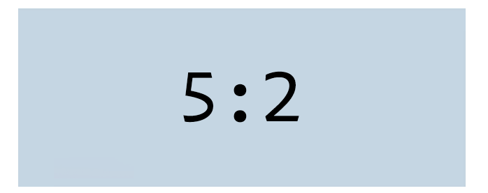

# LINE-Deco-SimpleFrame

LINEのプロフィールに枠や余計な装飾を持たない画像を追加したい場合、あのなぜか異常なまでに横長い画像コンポーネントを用いないといけない。

このツールで、その画像コンポーネントに合うように画像サイズを変更できる、ただそれだけのツール。  
私に需要があるから作った。後悔はしていない。

## Deploy
`npm run build`でビルド、`npm run deploy`でGH Pagesにデプロイ。

## Info
- 使用技術
  - [Webpack](https://webpack.js.org/)
  - [Cropper.js](https://fengyuanchen.github.io/cropperjs/)
  - (公開: Github Pages)
- 制作時間
  - 1.0.0-beta1: 3時間